# server

[](https://github.com/jozefvalachovic/server/actions/workflows/ci.yml)
[](https://codecov.io/gh/jozefvalachovic/server)

Reusable building blocks for Go HTTP and TCP servers. The root module has one dependency (`logger/v4`) and requires Go 1.27+.

```
go get github.com/jozefvalachovic/server@latest
```

---

## Table of contents

- [Quick start](#quick-start)
- [Packages](#packages)
- [server](#server-1) — HTTP, TCP, metrics servers and health checks
- [Middleware](#middleware) — Auth, CORS, rate-limit, cache, compress, security, timeout, …
  - [Middleware ordering](#middleware-ordering)
- [routes](#routes) — Route registration, method routing, and Swagger helpers
- [response](#response) — Typed JSON response writers and request body decoding
- [request](#request) — IP address extraction, email validation
- [Request-scoped logging](#request-scoped-logging) — Automatic logger context enrichment
- [cache](#cache) — In-memory key-value store with TTL, eviction, and stats
- [client](#client) — Resilient HTTP client with retry and circuit breaker
- [mcp](#mcp) — Independent latest-only Model Context Protocol module
- [swagger](#swagger) — Auto-generated API documentation UI
- [admin](#admin) — Password-protected metrics and cache explorer UI
- [watch](#watch) — Hot-reload file watcher for development
- [config](#config) — Default timeouts, limits, and shared constants
- [Sentinel errors](#sentinel-errors)
- [Environment variables](#environment-variables)
- [Graceful shutdown](#graceful-shutdown)
- [Testing](#testing)
- [License](#license)

---

## Quick start

```go
package main

import (
    "context"
    "log"
    "net/http"
    "os"
    "os/signal"
    "syscall"
    "time"

    "github.com/jozefvalachovic/server/cache"
    "github.com/jozefvalachovic/server/response"
    "github.com/jozefvalachovic/server/routes"
    "github.com/jozefvalachovic/server/server"
    "github.com/jozefvalachovic/server/watch"
)

func main() {
    watch.Init() // hot-reload when DEV=1

    mux := http.NewServeMux()
    store, _ := routes.RegisterRoutesWithStore(mux, &cache.CacheConfig{
        MaxSize: 1000, MaxMemoryMB: 256, DefaultTTL: 5 * time.Minute, CleanupInterval: time.Minute,
    }, func(mux *http.ServeMux, store *cache.CacheStore) {
        mux.HandleFunc("GET /ping", func(w http.ResponseWriter, r *http.Request) {
            response.APIResponseWriter(w, "pong", http.StatusOK)
        })
    })
    _ = store

    hc := server.NewHealthChecker("1.0.0", 5*time.Second)
    mux.HandleFunc("GET /healthz", hc.LivenessHandler())
    mux.HandleFunc("GET /readyz", hc.ReadinessHandler())

    srv, err := server.NewHTTPServer(mux, "my-app", "1.0.0", server.HTTPServerConfig{})
    if err != nil {
        log.Fatal(err)
    }

    quit := make(chan os.Signal, 1)
    signal.Notify(quit, syscall.SIGINT, syscall.SIGTERM)

    if err := srv.Start(); err != nil {
        log.Fatal(err)
    }

    <-quit // block until signal
    ctx, cancel := context.WithTimeout(context.Background(), 15*time.Second)
    defer cancel()
    if err := srv.GracefulShutdown(ctx); err != nil {
        log.Printf("shutdown error: %v", err)
    }
}
```

```bash
HTTP_HOST=127.0.0.1 HTTP_PORT=8080 go run .
```

Run the bundled example with hot-reload:

```bash
./example.sh
# Open http://127.0.0.1:8080/docs
```

---

## Packages

| Package                     | Import              | Purpose                                                       |
| --------------------------- | ------------------- | ------------------------------------------------------------- |
| [`server`](#server-1)       | `server/server`     | HTTP, TCP, and metrics servers with graceful shutdown         |
| [`middleware`](#middleware) | `server/middleware` | Auth, CORS, rate-limit, cache, compress, security, timeout, … |
| [`routes`](#routes)         | `server/routes`     | Route registration, method routing, and Swagger helpers       |
| [`response`](#response)     | `server/response`   | Typed JSON response writers and request body decoding         |
| [`request`](#request)       | `server/request`    | IP address extraction, email validation                       |
| [`cache`](#cache)           | `server/cache`      | In-memory key-value store with TTL, eviction, and stats       |
| [`client`](#client)         | `server/client`     | Resilient HTTP client with retry and circuit breaker          |
| [`mcp`](#mcp)               | `server/mcp`        | Independent latest-only MCP server module                     |
| [`swagger`](#swagger)       | `server/swagger`    | Auto-generated Swagger UI from Go types                       |
| [`watch`](#watch)           | `server/watch`      | Hot-reload file watcher for development                       |

Internal packages (`internal/admin`, `internal/config`, `internal/ui`) are not importable by external consumers. The admin dashboard and shared constants are wired automatically by `server.NewHTTPServer`.

The `server` package re-exports client and middleware config types so most applications only need a single import:

```go
server.NewClient(server.ClientConfig{...})          // wraps client.New
server.HTTPRateLimitConfig{...}                      // re-exported from middleware
server.CORSConfig{...}                              // re-exported from middleware
server.AuthConfig{...}                              // re-exported from middleware
server.IPFilterConfig{...}                          // re-exported from middleware
server.CompressConfig{...}                          // re-exported from middleware
server.TimeoutConfig{...}                           // re-exported from middleware
server.RequestIDConfig{...}                         // re-exported from middleware
server.RequestSizeConfig{...}                       // re-exported from middleware
server.TraceContextConfig{...}                      // re-exported from middleware
server.ClientConfig{...}                            // re-exported from client
server.ClientRetryConfig{...}                       // re-exported from client
server.ClientCircuitBreakerConfig{...}              // re-exported from client
```

---

## server

HTTP and TCP servers with TLS, graceful shutdown, and optional metrics sidecar.

### HTTP server

```go
srv, err := server.NewHTTPServer(mux, "app", "1.0.0", server.HTTPServerConfig{
    ReadTimeout:  30 * time.Second,
    WriteTimeout: 60 * time.Second,
    MaxConns:     10_000,
    MaxHeaderBytes: 1 << 20,        // 1 MiB (default)
    MaxHeaderValueCount: 100,       // total header values per request
    TLSConfig:    tlsCfg,           // reads HTTP_TLS_CERT_PATH / HTTP_TLS_KEY_PATH
    AutoCertReload: true,           // hot-swap certs without restart
    CORS:         &server.CORSConfig{AllowedOrigins: []string{"https://example.com"}},
    RateLimitConfig: &server.HTTPRateLimitConfig{RequestsPerSecond: 100, Burst: 200},
    Compress:     &server.CompressConfig{Enabled: true},
    Admin:        &server.AdminConfig{AppName: "app", AppVersion: "1.0.0", Store: store},
    AuditConfig:  &server.HTTPAuditConfig{Enabled: true, Methods: []string{"POST", "PUT", "DELETE"}},
    OTelBridge:   &server.OTelBridgeConfig{ServiceName: "app", ServiceVersion: "1.0.0"},
    MetricsServerConfig: &server.MetricsServerConfig{Handler: promHandler},
    BaseContext:  func(net.Listener) context.Context { return baseCtx },
    ConnContext:  func(ctx context.Context, c net.Conn) context.Context { return ctx },
    Middlewares:  []server.HTTPMiddleware{customLogger},
})
```

**`HTTPServerConfig` fields:**

| Field                 | Type                                              | Default                | Description                                                            |
| --------------------- | ------------------------------------------------- | ---------------------- | ---------------------------------------------------------------------- |
| `TLSConfig`           | `*tls.Config`                                     | nil (plain HTTP)       | TLS configuration; requires `HTTP_TLS_CERT_PATH` / `HTTP_TLS_KEY_PATH` |
| `AutoCertReload`      | `bool`                                            | false                  | Poll cert/key files and hot-swap without restart                       |
| `CertReloadInterval`  | `time.Duration`                                   | 30 s                   | Polling interval for cert file changes                                 |
| `ReadTimeout`         | `time.Duration`                                   | 30 s                   | Max duration for reading the entire request                            |
| `WriteTimeout`        | `time.Duration`                                   | 60 s                   | Max duration for writing the response                                  |
| `MaxConns`            | `int`                                             | 0 (unlimited)          | Max concurrent HTTP connections via listener semaphore                 |
| `MaxHeaderBytes`      | `int`                                             | 1 MiB                  | Max size of request headers                                            |
| `MaxHeaderValueCount` | `int`                                             | net/http default       | Max total header values per request; 0 uses the standard-library limit |
| `MetricsServerConfig` | `*MetricsServerConfig`                            | nil                    | Embedded metrics sidecar (e.g. Prometheus)                             |
| `AuditConfig`         | `*HTTPAuditConfig`                                | nil                    | Structured audit logging per request                                   |
| `OTelBridge`          | `*OTelBridgeConfig`                               | nil                    | OpenTelemetry log bridge (service.name + level mapping)                |
| `RateLimitConfig`     | `*HTTPRateLimitConfig`                            | nil                    | Per-client token-bucket rate limiting                                  |
| `CORS`                | `*CORSConfig`                                     | nil (disabled)         | Cross-Origin Resource Sharing headers                                  |
| `RequestID`           | `*RequestIDConfig`                                | defaults enabled       | Request-ID injection/propagation                                       |
| `TraceContext`        | `*TraceContextConfig`                             | defaults enabled       | W3C traceparent / tracestate propagation                               |
| `Timeout`             | `*TimeoutConfig`                                  | 30 s default           | Per-request handler timeout; set `Timeout: 0` to disable               |
| `IPFilter`            | `*IPFilterConfig`                                 | nil (allow all)        | IP allowlist/blocklist enforcement                                     |
| `Compress`            | `*CompressConfig`                                 | nil (disabled)         | gzip response compression (must set `Enabled: true`)                   |
| `Admin`               | `*AdminConfig`                                    | nil                    | Admin UI (metrics + cache explorer)                                    |
| `BaseContext`         | `func(net.Listener) context.Context`              | `context.Background()` | Base context for all requests                                          |
| `ConnContext`         | `func(context.Context, net.Conn) context.Context` | nil                    | Per-connection context modifier                                        |
| `Middlewares`         | `[]HTTPMiddleware`                                | nil                    | Additional middleware applied after the built-in stack                 |

**`HTTPAuditConfig`** — controls structured audit event emission:

| Field       | Type       | Default     | Description                                  |
| ----------- | ---------- | ----------- | -------------------------------------------- |
| `Enabled`   | `bool`     | false       | Activates per-request audit events           |
| `Methods`   | `[]string` | all methods | Restrict auditing to specific HTTP methods   |
| `SkipPaths` | `[]string` | none        | Paths excluded from access logging and audit |

| Environment variable | Required | Description                               |
| -------------------- | -------- | ----------------------------------------- |
| `HTTP_HOST`          | yes      | Bind address (IP literal, e.g. `0.0.0.0`) |
| `HTTP_PORT`          | yes      | Listen port (1–65535)                     |
| `HTTP_TLS_CERT_PATH` | no       | TLS certificate file path                 |
| `HTTP_TLS_KEY_PATH`  | no       | TLS private key file path                 |

**Methods:**

| Method                        | Description                                              |
| ----------------------------- | -------------------------------------------------------- |
| `Start() error`               | Begins listening in a background goroutine               |
| `GracefulShutdown(ctx) error` | Drains in-flight requests; respects the context deadline |
| `ForceShutdown()`             | Immediately closes the server and all connections        |

### TCP server

```go
srv, err := server.NewTCPServer(handler, "tcp-app", "1.0.0", server.TCPServerConfig{
    ReadTimeout:     15 * time.Second,
    WriteTimeout:    15 * time.Second,
    TLSConfig:       tlsCfg,
    RateLimitConfig: &server.TCPRateLimitConfig{ConnectionsPerSecond: 50},
    RejectMessage:   "-ERR server busy\r\n",
    Middlewares:     []server.TCPMiddleware{customTCPLogger},
    MetricsServerConfig: &server.MetricsServerConfig{Handler: promHandler},
})
```

**`TCPServerConfig` fields:**

| Field                 | Type                   | Default                              | Description                                    |
| --------------------- | ---------------------- | ------------------------------------ | ---------------------------------------------- |
| `TLSConfig`           | `*tls.Config`          | nil                                  | TLS on the listener                            |
| `ReadTimeout`         | `time.Duration`        | 15 s                                 | Per-operation read deadline                    |
| `WriteTimeout`        | `time.Duration`        | 15 s                                 | Per-operation write deadline                   |
| `RateLimitConfig`     | `*TCPRateLimitConfig`  | nil                                  | Per-IP connection rate limiting                |
| `MetricsServerConfig` | `*MetricsServerConfig` | nil                                  | Embedded metrics sidecar                       |
| `RejectMessage`       | `string`               | `"-ERR server at max capacity…\r\n"` | Written to connections rejected at capacity    |
| `Middlewares`         | `[]TCPMiddleware`      | nil                                  | Additional TCP middleware after built-in stack |

| Environment variable | Required | Description                                  |
| -------------------- | -------- | -------------------------------------------- |
| `TCP_HOST`           | yes      | Bind address                                 |
| `TCP_PORT`           | yes      | Listen port                                  |
| `TCP_MAX_CONNS`      | no       | Max concurrent connections (default: 10 000) |

**Methods:**

| Method                         | Description                                                   |
| ------------------------------ | ------------------------------------------------------------- |
| `Start() error`                | Begins listening in a background goroutine                    |
| `GracefulShutdown(ctx) error`  | Stops accepting; waits for active connections or ctx deadline |
| `ForceShutdown()`              | Immediately closes listener and all active connections        |
| `GetActiveConnections() int64` | Returns the current number of active connections              |

The TCP server wraps every connection in a `*deadlineConn` that resets read/write deadlines before each I/O operation. Handlers can type-assert `conn.(*deadlineConn)` and call `IsForceClosed()` to distinguish a server-initiated shutdown from a client disconnect.

### Health checks

```go
hc := server.NewHealthChecker("1.0.0", 5*time.Second)
hc.Register("postgres", func(ctx context.Context) error { return db.PingContext(ctx) })
hc.RegisterCritical("postgres", func(ctx context.Context) error { return db.PingContext(ctx) })
hc.Deregister("postgres")             // remove a check at runtime
hc.SetRedactCheckNames(true)          // hide dependency names in external responses

mux.HandleFunc("GET /healthz", hc.LivenessHandler())  // always 200 OK
mux.HandleFunc("GET /readyz",  hc.ReadinessHandler())  // 200 / 503 based on checks

// Programmatic access:
result := hc.Result(ctx) // HealthCheckResult{Status, Checks, Version}
```

`RegisterCritical` marks a dependency as essential. When **any** critical check fails, the overall status is forced to `down` (503) regardless of other check outcomes — causing Kubernetes to remove the pod from service. Use `Register` for non-essential dependencies whose failure should not trigger a pod restart.

Health status: `ok` (all pass), `degraded` (some non-critical fail — still returns 200), `down` (any critical fail, or all fail — returns 503).

The configured timeout bounds the entire readiness evaluation. Checks should still honor context cancellation so their own goroutines can exit promptly; a non-cooperative check is reported as down without blocking the readiness response indefinitely.

### Metrics server

A separate HTTP server for Prometheus or pprof handlers:

```go
ms, err := server.StartMetricsServer(&server.MetricsServerConfig{
    Handler:     promHandler,
    EnablePprof: true,
})
if err != nil {
    return err // invalid configuration, certificate, or bind address
}
defer func() {
    shutdownCtx, cancel := context.WithTimeout(context.Background(), 5*time.Second)
    defer cancel()
    _ = ms.Shutdown(shutdownCtx)
}()
```

`StartMetricsServer` binds the listener and loads any TLS certificate before returning, so startup failures are reported synchronously.

`EnablePprof` is off by default. When enabled, the standard `/debug/pprof/` subtree is mounted on the metrics listener, including Go 1.27's `/debug/pprof/goroutineleak` profile. Keep the listener on loopback or protect it with mTLS, a firewall, or a service mesh; profiles can expose sensitive process data.

| Environment variable    | Required       | Description                                    |
| ----------------------- | -------------- | ---------------------------------------------- |
| `METRICS_HOST`          | no             | Bind address (default: `127.0.0.1` / loopback) |
| `METRICS_PORT`          | yes            | Listen port                                    |
| `METRICS_TLS_CERT_PATH` | when TLS is on | TLS certificate file path                      |
| `METRICS_TLS_KEY_PATH`  | when TLS is on | TLS private key file path                      |

---

## middleware

All middleware follow the `func(http.Handler) http.Handler` pattern and can be applied per-route or server-wide via `HTTPServerConfig.Middlewares`.

### Middleware ordering

`NewHTTPServer` assembles a fixed middleware stack. Built-in middleware always executes in this order (outermost first):

```mermaid
flowchart TD
    A["1. Logger — access logging + optional audit"] --> B["2. Recovery — panic → 500 + stack trace"]
    B --> C["3. Security — CSP, HSTS, X-Frame-Options, …"]
    C --> D{"IPFilter configured?"}
    D -- yes --> E["4. IPFilter — CIDR allowlist / blocklist"]
    D -- no --> F["5. RequestSize — body size limit"]
    E --> F
    F --> G{"RateLimit configured?"}
    G -- yes --> H["6. RateLimit — token-bucket per-client"]
    G -- no --> I{"CORS configured?"}
    H --> I
    I -- yes --> J["7. CORS — Cross-Origin headers"]
    I -- no --> K["8. RequestID — X-Request-ID injection"]
    J --> K
    K --> L["9. TraceContext — W3C traceparent / tracestate"]
    L --> M{"Timeout configured?"}
    M -- yes --> N["10. Timeout — per-request deadline"]
    M -- no --> O{"Compress enabled?"}
    N --> O
    O -- yes --> P["11. Compress — gzip encoding"]
    O -- no --> Q{"Admin configured?"}
    P --> Q
    Q -- yes --> R["12. Admin Collector — per-route metrics"]
    Q -- no --> S["13. User Middlewares — cfg.Middlewares"]
    R --> S
    S --> T["Handler mux"]
```



Custom middleware passed via `Middlewares` runs after all built-in layers and before the handler. Index 0 executes first.

### Auth

```go
authMw := middleware.Auth(middleware.AuthConfig{
    Scheme: middleware.AuthSchemeBearer,
    Verify: func(ctx context.Context, token string) (string, error) {
        claims, err := validateJWT(token)
        return claims.Subject, err
    },
    Realm:     "MyAPI",                           // WWW-Authenticate challenge realm (default: "API")
    SkipPaths: []string{"/healthz", "/readyz"},
})

// Retrieve identity downstream:
identity := middleware.AuthIdentityFromContext(r)
```

| Field          | Type                                | Default       | Description                                               |
| -------------- | ----------------------------------- | ------------- | --------------------------------------------------------- |
| `Scheme`       | `AuthScheme`                        | `Bearer`      | `AuthSchemeBearer` or `AuthSchemeAPIKey`                  |
| `APIKeyHeader` | `string`                            | `"X-API-Key"` | Header name when scheme is APIKey                         |
| `Verify`       | `func(ctx, string) (string, error)` | **required**  | Validates credential, returns identity                    |
| `Realm`        | `string`                            | `"API"`       | Value for WWW-Authenticate challenge on 401               |
| `SkipPaths`    | `[]string`                          | none          | Exact match or prefix match (trailing `/`) to bypass auth |

`SkipPaths` supports both exact match (`"/healthz"`) and prefix match (`"/admin/"` matches all `/admin/*`).

**Token verification helpers:**

`TokenStore` is an exported, thread-safe in-memory token set for fast `O(1)` credential lookups. Use it with `MultiTokenVerify` or `RotatingTokenVerify` for multi-token and zero-downtime rotation scenarios. All internal comparisons use constant-time HMAC-SHA256 to prevent timing side-channels.

### HTTP cache

```go
cached := middleware.HTTPCache(middleware.HTTPCacheConfig{
    Store:     store,                              // *cache.CacheStore or any CacheBackend
    TTL:       5 * time.Minute,                    // 0 = use store default
    KeyPrefix: func(r *http.Request) string {
        return getUserID(r) + "_products"          // returning "" bypasses cache
    },
    InvalidateMethods: []string{"POST", "PUT"},    // default: POST, PUT, PATCH, DELETE
})
mux.Handle("GET /products", cached(productsHandler))
```

The `CacheBackend` interface (`Get`, `Set`, `Delete`, `DeleteByPrefix`) can be satisfied by `*cache.CacheStore` or a custom distributed backend.

**Caching is skipped when:**

- `cfg.Store` is nil or `cfg.KeyPrefix` is nil / returns `""`
- The client sends `Cache-Control: no-store`
- The response status is not 200
- The response sets a `Set-Cookie` header
- `Flush()` is called on the response writer (streaming)
- The underlying write to the client fails

Invalidation: a 2xx response to a method in `InvalidateMethods` deletes all entries under the request's key prefix.

**Ordering with Compress:** `HTTPCache` must sit **before** `Compress` in the middleware chain so it stores uncompressed bodies and `Compress` re-encodes them per request. This keeps one entry per URL rather than one per `Accept-Encoding` variant, and avoids serving pre-gzipped bytes to clients that do not accept gzip. The middleware explicitly rejects any response already carrying a `Content-Encoding` header to make the violation a cache miss rather than a silent corruption. `HTTPCache` intentionally does **not** honour `Cache-Control: no-cache` / `private` on responses — eligibility is decided by method, status, and the caller's `KeyPrefix`.

**Stale-while-revalidate (optional):**

```go
cached := middleware.HTTPCache(middleware.HTTPCacheConfig{
    Store:                store,
    TTL:                  60 * time.Second,  // fresh window
    StaleWhileRevalidate: 5 * time.Minute,   // serve stale + refresh in background
    StaleIfError:         5 * time.Minute,   // serve stale on handler 5xx
    KeyPrefix:            keyFn,
})
```

When `StaleWhileRevalidate > 0`, requests that arrive after `TTL` but within the stale window are served immediately with `X-Cache: STALE` and a background refresh is dispatched through `singleflight` so only one handler run per key, regardless of concurrency. `StaleIfError` extends the same stale window for the specific case of a non-2xx refresh: the previous good body is replayed with `X-Cache: STALE-ERROR` instead of surfacing the error to clients. Both default to zero (disabled) — behaviour is identical to the pre-SWR code path until you opt in. Entries are held in the store for `TTL + StaleWhileRevalidate + StaleIfError`, so cache memory scales accordingly.

### CORS

```go
middleware.CORS(middleware.CORSConfig{
    AllowedOrigins:   []string{"https://app.example.com"},
    AllowedMethods:   []string{"GET", "POST", "PUT", "DELETE"},
    AllowedHeaders:   []string{"Content-Type", "Authorization", "X-Request-ID"},
    ExposedHeaders:   []string{"X-Request-ID"},
    AllowCredentials: true,
    MaxAge:           24 * time.Hour,
})
```

| Field              | Type            | Default                                      | Description                          |
| ------------------ | --------------- | -------------------------------------------- | ------------------------------------ |
| `Disabled`         | `bool`          | false                                        | Set true for no-op passthrough       |
| `AllowedOrigins`   | `[]string`      | `["*"]`                                      | Allowed origins (`*` = any)          |
| `AllowedMethods`   | `[]string`      | GET, POST, PUT, PATCH, DELETE, OPTIONS, HEAD | Permitted HTTP methods               |
| `AllowedHeaders`   | `[]string`      | Content-Type, Authorization, X-Request-ID    | Permitted request headers            |
| `ExposedHeaders`   | `[]string`      | none                                         | Response headers browsers may access |
| `AllowCredentials` | `bool`          | false                                        | Allow cookies / HTTP auth            |
| `MaxAge`           | `time.Duration` | 1 hour                                       | Preflight cache duration             |

`AllowCredentials: true` with a wildcard `"*"` origin panics at startup — the Fetch spec forbids this combination.

Origin matching is case-insensitive per RFC 6454 (`strings.EqualFold`), so `"HTTPS://Example.COM"` matches a browser-sent `"https://example.com"`.

### Rate limiting

#### HTTP

```go
middleware.HTTPRateLimit(middleware.HTTPRateLimitConfig{
    RequestsPerSecond: 100,
    Burst:             200,
    KeyFunc:           func(r *http.Request) string { return r.Header.Get("X-API-Key") },
    StatusCode:        http.StatusTooManyRequests,
    CleanupInterval:   time.Minute,
    IdleTimeout:       5 * time.Minute,
    Context:           ctx, // cancel to stop cleanup goroutine (useful in tests)
})
```

| Field               | Type                         | Default    | Description                        |
| ------------------- | ---------------------------- | ---------- | ---------------------------------- |
| `RequestsPerSecond` | `float64`                    | 10         | Token refill rate per key          |
| `Burst`             | `int`                        | 20         | Max accumulated tokens             |
| `KeyFunc`           | `func(*http.Request) string` | remote IP  | Client identity function           |
| `StatusCode`        | `int`                        | 429        | HTTP status for rejected requests  |
| `CleanupInterval`   | `time.Duration`              | 1 min      | How often idle buckets are evicted |
| `IdleTimeout`       | `time.Duration`              | 5 min      | Bucket idle time before eviction   |
| `Context`           | `context.Context`            | background | Cancel to stop cleanup goroutine   |

#### TCP

```go
middleware.TCPRateLimit(middleware.TCPRateLimitConfig{
    ConnectionsPerSecond: 50,
    Burst:                100,
    KeyFunc:              func(c net.Conn) string { return connIP(c) },
    RejectMessage:        "-ERR rate limit exceeded\r\n",
    CleanupInterval:      time.Minute,
    IdleTimeout:          5 * time.Minute,
    Context:              ctx,
})
```

| Field                  | Type                    | Default                          | Description                           |
| ---------------------- | ----------------------- | -------------------------------- | ------------------------------------- |
| `ConnectionsPerSecond` | `float64`               | 10                               | Token refill rate per key             |
| `Burst`                | `int`                   | 20                               | Max accumulated tokens                |
| `KeyFunc`              | `func(net.Conn) string` | remote IP                        | Client identity function              |
| `RejectMessage`        | `string`                | `"-ERR rate limit exceeded\r\n"` | Written before closing rejected conns |
| `CleanupInterval`      | `time.Duration`         | 1 min                            | How often idle buckets are evicted    |
| `IdleTimeout`          | `time.Duration`         | 5 min                            | Bucket idle time before eviction      |
| `Context`              | `context.Context`       | background                       | Cancel to stop cleanup goroutine      |

Both rate limiters use per-key token buckets with automatic background cleanup. The HTTP rate limiter partitions buckets across 16 lock-sharded segments (keyed via `maphash`) so high-concurrency workloads rarely contend on the same lock.

When an HTTP request is rejected, the response includes a `Retry-After` header (in seconds) computed as `⌈1 / RequestsPerSecond⌉`, telling the client the minimum wait before retrying. The rejection also wraps the sentinel `middleware.ErrRateLimitExceeded` which can be checked with `errors.Is` in tests or middleware chains.

### IP filter

```go
middleware.IPFilter(middleware.IPFilterConfig{
    Allowlist:         []string{"10.0.0.0/8", "172.16.0.0/12"},
    Blocklist:         []string{"203.0.113.42"},
    TrustForwardedFor: true,
    TrustedProxies:    []string{"10.0.0.1/32", "10.0.0.2/32"},
})
```

| Field               | Type       | Default | Description                                                                  |
| ------------------- | ---------- | ------- | ---------------------------------------------------------------------------- |
| `Allowlist`         | `[]string` | none    | CIDR ranges or IPs permitted (empty = allow all subject to blocklist)        |
| `Blocklist`         | `[]string` | none    | CIDR ranges or IPs always denied                                             |
| `TrustForwardedFor` | `bool`     | false   | Use X-Forwarded-For to determine client IP                                   |
| `TrustedProxies`    | `[]string` | none    | CIDRs of trusted reverse proxies (required when `TrustForwardedFor` is true) |

**Important:** `TrustForwardedFor` without `TrustedProxies` falls back to `RemoteAddr` to prevent IP spoofing. The middleware walks XFF right-to-left, skipping trusted proxy hops, and uses the first non-trusted IP as the real client address.

Evaluation order: Allowlist → Blocklist → allow. Empty Allowlist + empty Blocklist = passthrough (no-op).

### Security headers

`middleware.Security` sets the following headers on every response:

| Header                      | Value                                                            |
| --------------------------- | ---------------------------------------------------------------- |
| `X-Content-Type-Options`    | `nosniff`                                                        |
| `X-Frame-Options`           | `DENY`                                                           |
| `Referrer-Policy`           | `strict-origin-when-cross-origin`                                |
| `Content-Security-Policy`   | `default-src 'self'; frame-ancestors 'none'`                     |
| `Permissions-Policy`        | `geolocation=(), microphone=(), camera=()`                       |
| `Strict-Transport-Security` | `max-age=31536000; includeSubDomains; preload` (production only) |

HSTS is only added when `ENV=production`. The admin and swagger UI pages override the CSP to allow their embedded scripts and styles.

> **CSRF note:** This library does not include CSRF token middleware because the
> built-in JSON API endpoints rely on `Content-Type: application/json` which is
> not submittable by plain HTML forms (the browser's SOP blocks cross-origin
> `fetch` with credentials unless CORS explicitly allows it). If your
> application serves HTML forms or accepts `application/x-www-form-urlencoded`
> requests that mutate state, add a dedicated CSRF middleware (e.g.
> double-submit cookie or synchroniser token) to `HTTPServerConfig.Middlewares`.

### Compress

```go
middleware.Compress(middleware.CompressConfig{
    Enabled:      true,
    Level:        gzip.BestSpeed,                        // default: gzip.DefaultCompression
    ContentTypes: []string{"application/json", "text/"}, // default: json, xml, text/*, js
})
```

| Field          | Type       | Default                                                                  | Description                                      |
| -------------- | ---------- | ------------------------------------------------------------------------ | ------------------------------------------------ |
| `Enabled`      | `bool`     | false                                                                    | Must be explicitly true to activate              |
| `Level`        | `int`      | `gzip.DefaultCompression`                                                | gzip level (1 = BestSpeed … 9 = BestCompression) |
| `ContentTypes` | `[]string` | `application/json`, `application/xml`, `text/`, `application/javascript` | Content-Type prefixes eligible for compression   |

`Vary: Accept-Encoding` is set on every response (compressed or not) so that shared caches (CDNs) store separate variants for gzip-capable and plain clients.

### Timeout

```go
middleware.Timeout(middleware.TimeoutConfig{
    Timeout:      10 * time.Second,
    ErrorMessage: "Request timed out. Please try again.",
    SkipPaths:    []string{"/events", "/stream/"},
    SSEPaths:     []string{"/sse/"},              // convenience; appended to SkipPaths
})
```

| Field             | Type            | Default                                | Description                                                                             |
| ----------------- | --------------- | -------------------------------------- | --------------------------------------------------------------------------------------- |
| `Timeout`         | `time.Duration` | 30 s                                   | Per-request handler deadline                                                            |
| `ErrorMessage`    | `string`        | "Request timed out. Please try again." | Message in the 504 response body                                                        |
| `SkipPaths`       | `[]string`      | none                                   | Exact or prefix paths (trailing `/`) exempt from timeout                                |
| `SSEPaths`        | `[]string`      | none                                   | Convenience for streaming routes; merged into `SkipPaths`                               |
| `WarnOnLeakAfter` | `time.Duration` | 0 (disabled)                           | If > 0, log a warning when a timed-out handler is still running after this grace window |

When the deadline fires, a 504 response is written and `r.Context()` is cancelled. If the handler already committed a response, no 504 is injected. Panics inside the timeout goroutine are recovered.

> **Leaked-goroutine caveat:** cancelling the context does **not** forcibly stop
> the handler goroutine (Go has no safe preemption). A handler that ignores
> `r.Context().Done()` (e.g. a synchronous `db.Query` instead of `db.QueryContext`)
> keeps running after the client received the 504. Every timeout increments an
> internal counter and logs a warning; set `WarnOnLeakAfter` to additionally
> detect handlers still running well past the deadline. Read the counters via
> `middleware.TimeoutMetrics()`.

> **SSE / long-poll note:** List SSE or streaming endpoint paths in `SSEPaths`
> (or `SkipPaths`) to exempt them from the per-request deadline. Streams are
> also capped by `http.Server.WriteTimeout`, so set `HTTPServerConfig.NoWriteTimeout = true`
> (or serve streams from a dedicated server) to avoid connection-level cut-offs.
> `NewHTTPServer` logs a warning on startup if `SSEPaths` is set while
> `WriteTimeout` is non-zero. Also ensure SSE handlers send heartbeats within
> the server's `IdleTimeout` (default 30 s) to prevent the HTTP server from
> closing the idle connection. See `response.SSEWriter.SendHeartbeat`.

### Request ID

```go
middleware.RequestID(middleware.RequestIDConfig{
    Header:    "X-Correlation-ID",                // default: "X-Request-ID"
    Generator: uuid.NewString,                    // default: 16-byte crypto/rand hex
})

// Downstream access:
id := middleware.RequestIDFromContext(r)
```

| Field       | Type            | Default            | Description                           |
| ----------- | --------------- | ------------------ | ------------------------------------- |
| `Header`    | `string`        | `"X-Request-ID"`   | Header name to read/write             |
| `Generator` | `func() string` | 16-byte random hex | ID generator for requests without one |

If the incoming request already carries the header, the existing value is preserved.

The middleware also enriches the request-scoped logger (via `logger.NewContext`) with the `requestId` field, so all downstream log calls using `logger.FromContext(r.Context())` automatically include the request ID.

### Trace context (W3C)

```go
// Default — enabled automatically; no configuration needed.
// Disable explicitly:
middleware.TraceContext(middleware.TraceContextConfig{Disabled: true})

// Downstream access:
info := middleware.TraceInfoFromContext(r)
fmt.Println(info.TraceID, info.SpanID, info.ParentSpanID)
```

| Field      | Type   | Description                                                     |
| ---------- | ------ | --------------------------------------------------------------- |
| `Disabled` | `bool` | Set true to turn off trace-context propagation (default: false) |

Propagates the `traceparent` and `tracestate` headers per the
[W3C Trace Context](https://www.w3.org/TR/trace-context/) specification.
When the incoming request carries a valid `traceparent`, the trace-id and
flags are preserved; a new span-id is generated for this service. When
absent or malformed, a brand-new trace is started.

The middleware enriches the request-scoped logger with `traceId` and `spanId` fields, so all downstream log calls using `logger.FromContext(r.Context())` automatically include trace identifiers.

`TraceInfoFromContext(r)` returns a `TraceInfo` struct:

| Field          | Type     | Description                              |
| -------------- | -------- | ---------------------------------------- |
| `TraceID`      | `string` | 32-hex-char trace identifier             |
| `SpanID`       | `string` | 16-hex-char span identifier (this hop)   |
| `ParentSpanID` | `string` | 16-hex-char parent span from caller      |
| `TraceFlags`   | `string` | 2-hex-char flags (e.g. `"01"` = sampled) |
| `TraceState`   | `string` | Vendor-specific tracestate value         |

### Request size

```go
// Simple — uses MAX_REQUEST_SIZE_MB env or 10 MiB default:
middleware.RequestSize(handler)

// Configurable:
middleware.RequestSizeWithConfig(middleware.RequestSizeConfig{
    MaxSizeMB: 50,
})
```

| Field       | Type    | Default | Description                                                    |
| ----------- | ------- | ------- | -------------------------------------------------------------- |
| `MaxSizeMB` | `int64` | 10      | Max body size in MiB; `MAX_REQUEST_SIZE_MB` env overrides this |

GET, HEAD, and OPTIONS requests skip size limiting.

### Other middleware

| Middleware | Usage                          | Notes                                          |
| ---------- | ------------------------------ | ---------------------------------------------- |
| `Recovery` | `middleware.Recovery(handler)` | Catches panics, logs stack traces, returns 500 |

---

## routes

Helper functions for registering routes on `http.ServeMux`.

```go
// Register routes with automatic cache store creation. Registrars receive the
// created *cache.CacheStore so they can build cached handlers without relying
// on any package-global state (safe for parallel tests and multi-store setups).
store, err := routes.RegisterRoutesWithStore(mux, &cache.CacheConfig{...}, registrarA, registrarB)

// Method routing with 405 Method Not Allowed + Allow header
mux.HandleFunc("/products", routes.RouteHandler(routes.Routes{
    "GET":  listProducts,
    "POST": createProduct,
}))

// Cached route handler — pass the store received by the registrar explicitly.
func productRegistrar(mux *http.ServeMux, store *cache.CacheStore) {
    mux.HandleFunc("/products", routes.CachedRouteHandlerWithStore(store, routes.Routes{
        "GET":  listProducts,
        "POST": createProduct,
    }, middleware.HTTPCacheConfig{TTL: 5 * time.Minute, KeyPrefix: keyFn}))
}

// Per-route middleware
routes.RegisterRoute(mux, routes.Route{
    Method: "GET", Path: "/admin/users",
    Handler: listUsers,
    Middlewares: []func(http.Handler) http.Handler{adminAuth},
})

// Batch register with automatic 405 grouping
routes.RegisterRouteList(mux, []routes.Route{
    {Method: "GET", Path: "/users", Handler: listUsers},
    {Method: "POST", Path: "/users", Handler: createUser, Middlewares: []func(http.Handler) http.Handler{auth}},
})

// Simple readiness endpoint
routes.RegisterReadinessEndpoint(mux, func() bool { return dbHealthy })

// Mount Swagger
routes.RegisterSwagger(mux, "/docs", swagger.Config{...})
```

`RegisterRoutesWithStore` passes the created `*cache.CacheStore` to each
registrar, and `CachedRouteHandlerWithStore` takes that store explicitly. This
uses no package-global state, so it is safe for parallel tests and processes
that build more than one mux tree or cache store.

> **Deprecated:** the older `routes.RegisterRoutes` + `routes.CachedRouteHandler`
> pair relied on a process-global active store. It still works (one mux per
> process) but is unsafe with multiple concurrent stores and will be removed in
> v2 — prefer `RegisterRoutesWithStore` + `CachedRouteHandlerWithStore`.

---

## response

Typed JSON response writers and request body decoding.

```go
// Success
response.APIResponseWriter(w, product, http.StatusOK)

// Success with message
response.APIResponseWriterWithMessage(w, user, http.StatusOK, "User updated successfully")

// 201 Created with Location header
response.APICreated(w, product, "/products/"+product.ID)

// 204 No Content (DELETE, PUT with no body)
response.APINoContent(w)

// Offset pagination
response.APIResponseWriterWithPagination(w, products, http.StatusOK, limit, offset, totalCount)

// Cursor pagination
response.APIResponseWriterWithCursorPagination(w, products, http.StatusOK, response.ResponseCursorPagination{
    NextCursor: nextCur,
    HasMore:    len(products) == pageSize,
    PageSize:   pageSize,
})

// Warnings (deprecation notices, partial success)
response.APIResponseWriterWithWarnings(w, data, http.StatusOK, []string{"This endpoint is deprecated. Use /v2/products."})

// ETag + conditional 304 Not Modified
response.APIResponseWriterWithETag(w, r, data, http.StatusOK)

// Error with details
response.APIErrorWriter(w, response.APIError[any]{
    Code:    http.StatusBadRequest,
    Message: "validation failed",
    Details: "field 'name' is required",
})

// Error shortcuts
response.APIBadRequest(w, "validation failed", "field 'name' is required")
response.APIUnauthorized(w, "invalid token")
response.APIForbidden(w, "insufficient permissions")
response.APINotFound(w, "user not found")
response.APIConflict(w, "email already taken")
response.APIInternalError(w, "unexpected failure")
response.APIServiceUnavailable(w, "try again later")

// SSE streaming
stream := response.NewSSEWriter[Event](w, r)
defer stream.Close()
for event := range ch {
    if err := stream.Send(event); err != nil {
        break
    }
}
stream.SendHeartbeat() // keep-alive comment

// Decode + validate request body (rejects unknown fields)
product, apiErr := response.ValidateAndDecode[Product](r)
if apiErr != nil {
    response.APIErrorWriter(w, *apiErr)
    return
}
```

**Response envelope:**

```json
{
  "code": 200,
  "data": { ... },
  "message": "optional",
  "warnings": ["optional deprecation notice"],
  "metadata": { ... },
  "preferences": { ... },
  "pagination": {
    "limit": 20,
    "offset": 0,
    "totalCount": 142,
    "totalPages": 8,
    "currentPage": 1,
    "hasMore": true
  },
  "cursorPagination": {
    "nextCursor": "eyJpZCI6MTAwfQ",
    "prevCursor": "eyJpZCI6ODF9",
    "hasMore": true,
    "pageSize": 20
  }
}
```

**Error envelope:**

```json
{
  "code": 400,
  "data": null,
  "error": "Bad Request",
  "message": "validation failed",
  "details": "field 'name' is required"
}
```

**Streaming envelope** (`APIStream[T]`):

```json
{
  "code": 200,
  "data": { ... },
  "error": null,
  "message": null,
  "details": ""
}
```

**Writers:**

| Function                                   | Description                                                                |
| ------------------------------------------ | -------------------------------------------------------------------------- |
| `APIResponseWriter[T]`                     | Standard success response                                                  |
| `APIResponseWriterWithMessage[T]`          | Success response with informational message                                |
| `APIResponseWriterWithPagination[T]`       | Success response with offset-based pagination                              |
| `APIResponseWriterWithCursorPagination[T]` | Success response with cursor-based pagination                              |
| `APIResponseWriterWithWarnings[T]`         | Success response with warning strings                                      |
| `APIResponseWriterWithETag[T]`             | Deterministic response and ETag; returns 304 on a matching `If-None-Match` |
| `APICreated[T]`                            | 201 Created with `Location` header                                         |
| `APINoContent`                             | 204 No Content (no body)                                                   |
| `APIErrorWriter[T]`                        | Generic error response from `APIError[T]`                                  |
| `APIBadRequest`                            | 400 shortcut with message + details                                        |
| `APIUnauthorized`                          | 401 shortcut                                                               |
| `APIForbidden`                             | 403 shortcut                                                               |
| `APINotFound`                              | 404 shortcut                                                               |
| `APIConflict`                              | 409 shortcut                                                               |
| `APIInternalError`                         | 500 shortcut                                                               |
| `APIServiceUnavailable`                    | 503 shortcut                                                               |

**SSE streaming:**

| Method                  | Description                                                |
| ----------------------- | ---------------------------------------------------------- |
| `NewSSEWriter[T](w, r)` | Initialises an SSE stream (sets headers, returns writer)   |
| `Send(data T)`          | Writes a `data:` event with an `APIStream[T]` envelope     |
| `SendError(msg, det)`   | Writes an `event: error` event and closes the stream       |
| `SendHeartbeat()`       | Writes a keep-alive comment with a `HeartbeatData` payload |
| `Close()`               | Writes a final `event: done` and marks the writer closed   |

**Types:**

| Type                       | Description                                                            |
| -------------------------- | ---------------------------------------------------------------------- |
| `APIResponse[T]`           | Success envelope with optional `Metadata`, `Preferences`, `Pagination` |
| `ResponseOffsetPagination` | Offset-based pagination metadata                                       |
| `ResponseCursorPagination` | Cursor-based pagination metadata                                       |
| `APIError[T]`              | Error envelope with `Error`, `Message`, `Details`, optional `Data`     |
| `APIStream[T]`             | Streaming event envelope                                               |
| `SSEWriter[T]`             | Server-Sent Events writer with heartbeats and context awareness        |
| `HeartbeatData`            | SSE heartbeat payload (`type`, `timestamp`, `sent`)                    |

**Sentinel error pointers:**

Pre-allocated `*string` pointers for common error labels. Using these avoids a heap allocation per error response, reducing GC pressure under sustained rejection traffic (rate limiting, auth failures, etc.).

```go
response.ErrBadRequest         // "Bad Request"
response.ErrUnauthorized       // "Unauthorized"
response.ErrForbidden          // "Forbidden"
response.ErrNotFound           // "Not Found"
response.ErrMethodNotAllowed   // "Method Not Allowed"
response.ErrConflict           // "Conflict"
response.ErrTooManyRequests    // "Too Many Requests"
response.ErrInternalServer     // "Internal Server Error"
response.ErrGatewayTimeout     // "Gateway Timeout"
response.ErrBadGateway         // "Fetch failed"
response.ErrServiceUnavailable // "Service Unavailable"
```

The error shortcut functions (`APIBadRequest`, `APIUnauthorized`, etc.) and middleware already use these sentinels. Custom handlers can reference them to avoid allocating duplicate strings.

`ValidateAndDecode[T]` uses Go 1.27's `encoding/json/v2` decoder. It rejects unknown, duplicate, and case-mismatched JSON object members, trailing JSON values, nil/empty bodies, and bodies exceeding the `MaxBytesReader` limit (returns 413).

---

## request

```go
err := request.ValidateEmail(email)     // RFC 5322 validation
clean := request.SanitizeEmail(email)   // lowercase + trim
```

> **Deprecated:** `request.GetIPAddress` is deprecated. Use `middleware.IPFilter`
> with `TrustedProxies` for secure client-IP resolution that prevents spoofing
> via `X-Forwarded-For`.

---

## Request-scoped logging

The `RequestID` and `TraceContext` middleware automatically enrich the request-scoped logger carried in `context.Context`. Every handler downstream can retrieve the enriched logger without manually threading fields:

```go
func myHandler(w http.ResponseWriter, r *http.Request) {
    log := logger.FromContext(r.Context())
    log.LogInfo("handling request")
    // Output includes requestId, traceId, spanId automatically
}
```

The enrichment chain builds incrementally through the middleware stack:

| Middleware     | Fields added        |
| -------------- | ------------------- |
| `RequestID`    | `requestId`         |
| `TraceContext` | `traceId`, `spanId` |

Custom middleware can further extend the context logger using the same pattern:

```go
child := logger.FromContext(ctx).With("userId", uid)
ctx = logger.NewContext(ctx, child)
```

---

## cache

In-memory key-value store with TTL, oldest-first eviction, memory limits, and lazy expiry on read.

Internally the store partitions entries across **16 lock-sharded segments** (keyed via `maphash`), so concurrent reads and writes to different keys rarely contend on the same lock. All public methods are safe for concurrent use.

The eviction policy is **oldest-first (FIFO)**: a min-heap ordered by `createdAt` evicts the entry that was inserted earliest. Updating a key refreshes its TTL but preserves the original `createdAt`, so frequently-refreshed hot keys are not pinned against eviction.

```go
store, err := cache.NewCacheStore(cache.CacheConfig{
    MaxSize:         10_000,           // max entries; required (> 0)
    DefaultTTL:      5 * time.Minute,  // required (> 0)
    CleanupInterval: time.Minute,      // required (> 0)
    MaxMemoryMB:     256,              // byte-level memory cap; required (> 0)
})
defer store.Stop()

store.Set("user:42", userData, nil)                            // default TTL
store.Set("session:abc", session, new(30 * time.Minute))       // custom TTL
val, err := store.Get("user:42")                               // returns cache.ErrNotFound if missing/expired
store.Delete("user:42")
store.DeleteByPrefix("session:")
store.Flush()

stats := store.GetStats()       // CacheStats{Hits, Misses, Sets, Deletes, Evictions, Size, BytesUsed}
exported := store.Export()      // snapshot of all entries
```

**Sentinel errors:**

| Error                             | Condition                                   |
| --------------------------------- | ------------------------------------------- |
| `cache.ErrNotFound`               | Key missing or expired                      |
| `cache.ErrInvalidKey`             | Empty key string                            |
| `cache.ErrInvalidTTL`             | TTL ≤ 0                                     |
| `cache.ErrInvalidCleanupInterval` | CleanupInterval ≤ 0                         |
| `cache.ErrInvalidMaxSize`         | MaxSize ≤ 0                                 |
| `cache.ErrInvalidMaxMemory`       | MaxMemoryMB ≤ 0                             |
| `cache.ErrEntryTooLarge`          | Entry exceeds `MaxMemoryMB` and was evicted |

**Cache keys for HTTP response caching:**

```go
key := cache.BuildResponseKey("u42_products", "/api/products", "page=2&category=shoes")
// → "u42_products:GET:/api/products:category=shoes&page=2"  (query params sorted)
```

---

## client

Resilient HTTP client with exponential backoff retry, circuit breaker, and base URL support.

```go
c := server.NewClient(server.ClientConfig{
    Timeout:   10 * time.Second,
    BaseURL:   "https://api.example.com/v1",
    Transport: http.DefaultTransport,           // optional custom transport
    Retry: &server.ClientRetryConfig{
        MaxRetries:     3,
        InitialBackoff: 100 * time.Millisecond,
        MaxBackoff:     10 * time.Second,
        Multiplier:     2.0,
        JitterFraction: 0.2,
        ShouldRetry:    nil,                    // default: 429, 502, 503, 504 + network errors
    },
    CircuitBreaker: &server.ClientCircuitBreakerConfig{
        Threshold:        5,                    // open after 5 consecutive failures
        OpenDuration:     30 * time.Second,     // time before half-open probe
        SuccessThreshold: 1,                    // successes needed to close again
    },
})

resp, err := c.Get(ctx, "/users")
resp, err := c.Post(ctx, "/users", "application/json", body)
resp, err := c.Do(customReq)

if errors.Is(err, client.ErrCircuitOpen) {
    // circuit breaker is open — back off
}
```

**Retry backoff formula (equal jitter):**

```
base   = InitialBackoff × Multiplier^(attempt-1)
backoff = base × (1 − JitterFraction) + rand[0, base × JitterFraction)
```

Equal jitter keeps a fixed floor of `base × (1 − JitterFraction)` and adds a
uniform random component, so the delay stays in `[base × (1 − frac), base]` and
never collapses toward an immediate retry. Capped at `MaxBackoff`. Defaults:
`Multiplier=2.0`, `JitterFraction=0.2` (delay in `[0.8·base, base]`),
`MaxBackoff=10s`. A `Multiplier` below 1 is clamped up to 2.0 so backoff never
shrinks across attempts.

**Circuit breaker states:**

The circuit breaker is **per-`Client` instance**, not per-host. If the client is used against multiple backends, failures to one backend count towards the shared failure threshold. Create separate `Client` instances when independent circuit breakers per upstream are needed.

```
Closed ──(Threshold consecutive failures)──► Open
  ▲                                             │
  │                                    (after OpenDuration)
  │                                             ▼
  └──(SuccessThreshold probe successes)──── Half-Open
```

In half-open state, only one probe request is allowed through at a time. If a probe succeeds, the success counter increments; once `SuccessThreshold` is reached the circuit closes. Any failure in half-open immediately re-opens the circuit.

**`RetryConfig` fields:**

| Field            | Type                               | Default               | Description                     |
| ---------------- | ---------------------------------- | --------------------- | ------------------------------- |
| `MaxRetries`     | `int`                              | 3                     | Max retries after first attempt |
| `InitialBackoff` | `time.Duration`                    | 100 ms                | Base wait before first retry    |
| `MaxBackoff`     | `time.Duration`                    | 10 s                  | Backoff cap                     |
| `Multiplier`     | `float64`                          | 2.0                   | Exponential growth factor       |
| `JitterFraction` | `float64`                          | 0.2                   | Random jitter ± fraction        |
| `ShouldRetry`    | `func(*http.Response, error) bool` | 429/502/503/504 + err | Override retry decision         |

**`CircuitBreakerConfig` fields:**

| Field              | Type            | Default | Description                     |
| ------------------ | --------------- | ------- | ------------------------------- |
| `Threshold`        | `int`           | 5       | Failures before opening circuit |
| `OpenDuration`     | `time.Duration` | 30 s    | Wait before half-open probe     |
| `SuccessThreshold` | `int`           | 1       | Probe successes needed to close |

---

## mcp

[Model Context Protocol](https://modelcontextprotocol.io/) support lives in an
independent nested Go module so the official SDK and its transitive dependencies
do not enter the root server module:

```bash
go get github.com/jozefvalachovic/server/mcp@latest
```

The module wraps `github.com/modelcontextprotocol/go-sdk` and supports only MCP
`2026-07-28`. It intentionally does not implement the legacy `initialize`
handshake or earlier protocol versions.

`mcp.Version` reports the nested module's release version. `Config.Version`
identifies the consuming server and is advertised to MCP clients.

```go
type GetProductInput struct {
    ID int `json:"id" jsonschema:"product ID"`
}

type GetProductOutput struct {
    Name string `json:"name"`
}

mcpServer, err := mcp.New(mcp.Config{
    Name:    "my-service",
    Version: "1.0.0",
    AllowedOrigins: []string{"https://app.example.com"},
    Authenticate: func(ctx context.Context, r *http.Request) (context.Context, error) {
        if r.Header.Get("Authorization") != "Bearer secret" {
            return nil, errors.New("unauthorized")
        }
        return ctx, nil
    },
    MaxRequestBodyBytes: 1 << 20,
    RequestTimeout:      30 * time.Second,
    MaxConcurrent:       64,
    RateLimit: &mcp.RateLimitConfig{
        RequestsPerSecond: 100,
        Burst:             200,
    },
})
if err != nil {
    log.Fatal(err)
}

mcp.AddTool(mcpServer, &mcp.Tool{
    Name:        "get_product",
    Description: "Fetch a product by ID.",
}, func(ctx context.Context, request *mcp.CallToolRequest, input GetProductInput) (*mcp.CallToolResult, GetProductOutput, error) {
    product, err := findProduct(ctx, input.ID)
    if err != nil {
        return nil, GetProductOutput{}, err
    }
    return nil, GetProductOutput{Name: product.Name}, nil
})

mux.Handle("/mcp", mcpServer)
```

`AddTool` delegates JSON Schema inference, input/output validation, structured
results, discovery, and protocol errors to the official SDK. Use `SDK()` for
official SDK features such as prompts, resources, and custom methods. For local
process integrations, call `RunStdio(ctx)` instead of mounting the HTTP handler.

Streamable HTTP is stateless and uses JSON responses. Clients send one POST per
request with per-request protocol metadata; no session ID is issued, while GET
and DELETE return 405. Request cancellation is propagated to tool contexts.

| `Config` field        | Default     | Description                                                           |
| --------------------- | ----------- | --------------------------------------------------------------------- |
| `Name`, `Version`     | required    | Server identity returned by discovery                                 |
| `Instructions`        | empty       | Instructions advertised to clients                                    |
| `Logger`              | SDK default | `*slog.Logger` used by the official SDK                               |
| `AllowedOrigins`      | same-origin | Browser origins allowed by the built-in Origin policy; `*` allows any |
| `Authenticate`        | disabled    | Authenticates HTTP requests and may return a derived context          |
| `MaxRequestBodyBytes` | 1 MiB       | Maximum Streamable HTTP request body                                  |
| `RequestTimeout`      | 30 s        | Deadline propagated through each HTTP request                         |
| `MaxConcurrent`       | 64          | Process-local concurrent HTTP request limit                           |
| `RateLimit`           | disabled    | Optional process-local token bucket                                   |
| `Middleware`          | none        | Official SDK receiving middleware                                     |
| `Hooks`               | none        | MCP method start/finish hooks for metrics and tracing                 |
| `Audit`               | none        | HTTP completion hook, including policy rejections                     |

Do not stack a second CORS implementation around the MCP handler. Requests
without an `Origin` header, including typical server-to-server clients, are
accepted; browser requests require an explicit `AllowedOrigins` match.

---

## swagger

Embedded Swagger-like API documentation UI generated from Go types.

```go
routes.RegisterSwagger(mux, "/docs", swagger.Config{
    Title:       "Product API",
    Description: "CRUD operations for products",
    Version:     "1.0.0",
    Endpoints: []swagger.Endpoint{
        {
            Method:   swagger.POST,
            Path:     "/products",
            Summary:  "Create a product",
            Tags:     []string{"products"},
            Request:  (*CreateProductRequest)(nil),
            Response: (*Product)(nil),
        },
    },
})
```

---

## admin

> **Internal package** (`internal/admin`) — not directly importable. Configured via `server.AdminConfig`.

Password-protected admin UI with per-route metrics and cache explorer. Requires `ADMIN_NAME`, `ADMIN_SECRET`, and `ADMIN_SIGNING_KEY` environment variables.

```go
// Automatic wiring via HTTPServerConfig:
srv, _ := server.NewHTTPServer(mux, "app", "1.0.0", server.HTTPServerConfig{
    Admin: &server.AdminConfig{
        AppName:    "app",
        AppVersion: "1.0.0",
        Store:      store,           // nil disables cache section
    },
})
```

When `Admin` is set, `NewHTTPServer` creates a `Collector`, registers all admin routes, and wires the collector middleware automatically. No manual `admin.Register` call is needed.

**Registered routes:**

| Route           | Description                                  |
| --------------- | -------------------------------------------- |
| `/metrics/`     | Request count, latency, error rate per route |
| `/cache/`       | Browse, delete, flush cache entries          |
| `/metrics/auth` | Login page for the metrics section           |
| `/cache/auth`   | Login page for the cache section             |

Session-based HMAC-SHA256 auth with 8-hour TTL cookie. `ADMIN_SECRET` is the login password — it is hashed with PBKDF2-SHA256 at startup and never stored in plaintext. `ADMIN_SIGNING_KEY` is used exclusively for HMAC session/CSRF cookie signing, so compromise of one secret does not expose the other. Login attempts are rate-limited to 5 per IP address within a 15-minute window. A background janitor goroutine sweeps stale entries every 15 minutes to prevent unbounded memory growth from rotated source IPs.

**Standalone usage** (without `NewHTTPServer`):

```go
col := admin.NewCollector()
admin.Register(mux, admin.Config{
    AppName:    "app",
    AppVersion: "1.0.0",
    Collector:  col,
    Store:      store,
})
// Wire col.Middleware into your middleware stack manually.
```

---

## watch

Development-only hot-reload watcher. Call as the first statement in `main()`:

```go
func main() {
    watch.Init(watch.Config{
        ExtraDirs: []string{"templates"},   // additional directories to watch
        BuildArgs: []string{"-tags", "dev"},// extra flags for "go build"
        Ext:       ".go",                   // file extension to monitor (default: ".go")
        Interval:  500 * time.Millisecond,  // check interval (default: 500 ms)
    })
    // ... rest of application
}
```

| Field       | Type            | Default | Description                     |
| ----------- | --------------- | ------- | ------------------------------- |
| `ExtraDirs` | `[]string`      | none    | Additional directories to watch |
| `BuildArgs` | `[]string`      | none    | Extra `go build` flags          |
| `Ext`       | `string`        | `".go"` | File extension to monitor       |
| `Interval`  | `time.Duration` | 500 ms  | Filesystem poll interval        |

Activated by `DEV=1`. The watcher compiles via `go build` (leveraging the build cache for fast incremental restarts), runs the binary with `_WATCH_CHILD=1`, and restarts on file changes. No-op in production.

**Monorepo usage** (Go workspace):

```go
watch.Init(watch.Config{
    ExtraDirs: []string{"../../shared", "../../pkg"},
})
```

---

## config

> **Internal package** (`internal/config`) — not directly importable. Defaults are applied automatically by `server.NewHTTPServer`.

Shared default constants used by the server and middleware packages:

| Constant                | Value  | Used by                         |
| ----------------------- | ------ | ------------------------------- |
| `ShutdownTimeout`       | 15 s   | Graceful shutdown deadline      |
| `HTTPIdleTimeout`       | 30 s   | HTTP keep-alive idle            |
| `HTTPReadHeaderTimeout` | 5 s    | Header read deadline            |
| `TCPReadTimeout`        | 15 s   | TCP per-op read deadline        |
| `TCPWriteTimeout`       | 15 s   | TCP per-op write deadline       |
| `DefaultTCPMaxConns`    | 10 000 | Max concurrent TCP connections  |
| `DefaultReadTimeout`    | 30 s   | Controller/handler read budget  |
| `DefaultWriteTimeout`   | 60 s   | Controller/handler write budget |
| `DefaultStreamTimeout`  | 290 s  | SSE / long-poll budget          |
| `StreamSafetyMargin`    | 10 s   | Subtracted from stream timeout  |
| `WriteSafetyMargin`     | 5 s    | Subtracted from write timeout   |
| `MaxPageLimit`          | 1 000  | Max items per page              |
| `MaxOffset`             | 10 000 | Max pagination offset           |

`config.GetTCPMaxConns()` reads `TCP_MAX_CONNS` from the environment, falling back to `DefaultTCPMaxConns`.

---

## Sentinel errors

Use `errors.Is` to handle specific error conditions:

```go
import "github.com/jozefvalachovic/server/cache"
import "github.com/jozefvalachovic/server/client"
import "github.com/jozefvalachovic/server/middleware"

// Cache
val, err := store.Get("key")
if errors.Is(err, cache.ErrNotFound) {
    // key missing or expired
}

// Client circuit breaker
resp, err := c.Get(ctx, "/endpoint")
if errors.Is(err, client.ErrCircuitOpen) {
    // circuit is open — back off
}

// Rate limiting
if errors.Is(err, middleware.ErrRateLimitExceeded) {
    // request was rejected — check Retry-After header
}
```

| Package      | Error                       | Condition                             |
| ------------ | --------------------------- | ------------------------------------- |
| `cache`      | `ErrNotFound`               | Key missing or expired                |
| `cache`      | `ErrInvalidKey`             | Empty key string                      |
| `cache`      | `ErrInvalidTTL`             | TTL ≤ 0                               |
| `cache`      | `ErrInvalidCleanupInterval` | CleanupInterval ≤ 0                   |
| `cache`      | `ErrInvalidMaxSize`         | MaxSize ≤ 0                           |
| `cache`      | `ErrInvalidMaxMemory`       | MaxMemoryMB ≤ 0                       |
| `cache`      | `ErrEntryTooLarge`          | Entry exceeds `MaxMemoryMB` (evicted) |
| `client`     | `ErrCircuitOpen`            | Circuit breaker is open               |
| `middleware` | `ErrRateLimitExceeded`      | Rate limit bucket exhausted           |

---

## Environment variables

| Variable              | Package    | Required    | Description                                  |
| --------------------- | ---------- | ----------- | -------------------------------------------- |
| `HTTP_HOST`           | server     | yes         | HTTP bind address (IP literal)               |
| `HTTP_PORT`           | server     | yes         | HTTP listen port                             |
| `HTTP_TLS_CERT_PATH`  | server     | no          | TLS certificate path                         |
| `HTTP_TLS_KEY_PATH`   | server     | no          | TLS key path                                 |
| `TCP_HOST`            | server     | for TCP     | TCP bind address                             |
| `TCP_PORT`            | server     | for TCP     | TCP listen port                              |
| `TCP_MAX_CONNS`       | config     | no          | Max TCP connections (default: 10 000)        |
| `METRICS_HOST`        | server     | no          | Metrics bind address (default: 127.0.0.1)    |
| `METRICS_PORT`        | server     | for metrics | Metrics server port                          |
| `ADMIN_NAME`          | admin      | for admin   | Admin UI username                            |
| `ADMIN_SECRET`        | admin      | for admin   | Admin UI password (PBKDF2-hashed at startup) |
| `ADMIN_SIGNING_KEY`   | admin      | for admin   | HMAC key for session / CSRF signing          |
| `MAX_REQUEST_SIZE_MB` | middleware | no          | Body size limit override (default: 10)       |
| `ENV`                 | middleware | no          | Set to `production` for HSTS header          |
| `DEV`                 | watch      | no          | Set to `1` to enable hot-reload              |

---

## Graceful shutdown

Both HTTP and TCP servers support graceful and forced shutdown. The recommended pattern:

```go
quit := make(chan os.Signal, 1)
signal.Notify(quit, syscall.SIGINT, syscall.SIGTERM)

if err := srv.Start(); err != nil {
    log.Fatal(err)
}

<-quit // block until signal

// Optional: delay for load-balancer propagation (Kubernetes)
time.Sleep(5 * time.Second)

ctx, cancel := context.WithTimeout(context.Background(), 15*time.Second)
defer cancel()

if err := srv.GracefulShutdown(ctx); err != nil {
    log.Printf("shutdown error: %v", err)
    srv.ForceShutdown() // last resort
}
```

`GracefulShutdown` drains in-flight requests/connections within the context deadline; `ForceShutdown` immediately closes everything. Both also shut down the embedded metrics server if configured.

---

## Testing

### Rate limiter cleanup goroutines

Both `HTTPRateLimit` and `TCPRateLimit` spawn background cleanup goroutines. In tests, pass a cancellable `Context` to prevent goroutine leaks:

```go
func TestMyHandler(t *testing.T) {
    ctx, cancel := context.WithCancel(context.Background())
    defer cancel() // stops the cleanup goroutine

    rl := middleware.HTTPRateLimit(middleware.HTTPRateLimitConfig{
        RequestsPerSecond: 100,
        Burst:             200,
        Context:           ctx,
    })
    // ... use rl in test
}
```

### Cache in tests

Create a standalone `CacheStore` per test to avoid shared state:

```go
store, err := cache.NewCacheStore(cache.CacheConfig{
    MaxSize: 100, MaxMemoryMB: 64, DefaultTTL: time.Minute, CleanupInterval: time.Minute,
})
if err != nil {
    t.Fatal(err)
}
defer store.Stop()
```

### Handler testing with response types

Use `httptest.NewRecorder` with the response helpers:

```go
w := httptest.NewRecorder()
r := httptest.NewRequest("GET", "/products", nil)
handler.ServeHTTP(w, r)

var resp response.APIResponse[[]Product]
json.NewDecoder(w.Body).Decode(&resp)
// assert resp.Code, resp.Data, resp.Pagination, etc.
```

---

## License

Source-available — use and clone permitted; modifications, redistribution, and contributions are not accepted. See [LICENSE](LICENSE) for details.
